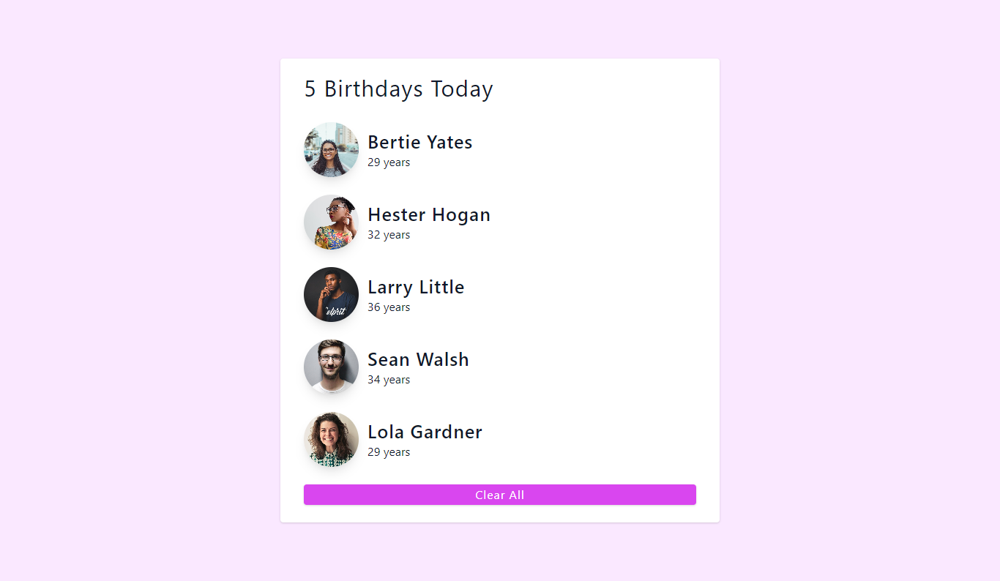

# Birhtday List App

## Table of contents

- [Birhtday List App](#birhtday-list-app)
  - [Table of contents](#table-of-contents)
  - [Overview](#overview)
    - [The challenge](#the-challenge)
    - [Screenshot](#screenshot)
    - [Links](#links)
  - [My process](#my-process)
    - [Built with](#built-with)
    - [Useful resources](#useful-resources)
  - [Author](#author)

## Overview

### The challenge

Users should be able to:

- View the optimal layout for the app depending on their device's screen size
- See hover states for all interactive elements on the page
- Clear list of items or people by clicking button

### Screenshot

### Links

- Live Site : [https://birthday-list-tstw.netlify.app/](https://birthday-list-tstw.netlify.app/)

## My process

### Built with

- Vite
- React
- Tailwind
- TypeScript
- Semantic HTML5 markup
- CSS custom properties
- Mobile-first workflow
- Flexbox

### Useful resources

- [React | JS library](https://reactjs.org/)
- [Vite](https://vitejs.dev/guide/)
- [Tailwind CSS | For styles](https://tailwindcss.com/)
- [A Complete Guide to Flexbox | CSS Tricks](https://css-tricks.com/snippets/css/a-guide-to-flexbox)

## Author

- Frontend Mentor - [@Panji200](https://www.frontendmentor.io/profile/Panji200)
- Website - [pperdana.netlify.app](https://pperdana.netlify.app)
