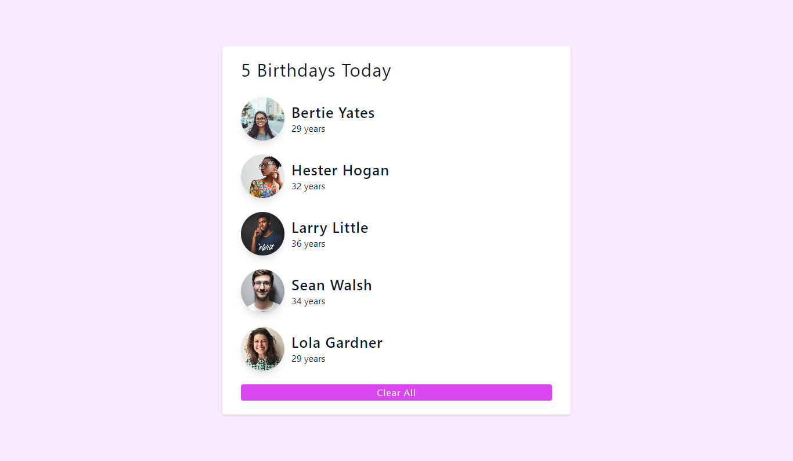

# Birhtday List App
Introducing "Birhtday List" app, Basically it's an application that show a list of people. It's  display the image, display the name, as well as the age, and this application also be able to clear the list.
## Table of contents
- [Overview](#overview)
  - [The challenge](#the-challenge)
  - [Screenshot](#screenshot)
  - [Links](#links)
- [My process](#my-process)
  - [Built with](#built-with)
  - [Useful resources](#useful-resources)
- [Author](#author)

## Overview

### The challenge

Users should be able to:

- View the optimal layout for the app depending on their device's screen size
- See hover states for all interactive elements on the page
- Clear list of items or people by clicking button

### Screenshot

### Links

- Live Site : [https://birthday-list-pperdana.netlify.app](https://birthday-list-pperdana.netlify.app)

## My process

### Built with

- React
- CSS custom properties
- Vite
- Semantic HTML5 markup
- Mobile-first workflow
- Flexbox

### Useful resources

- [React | JS library](https://reactjs.org/)
- [Vite](https://vitejs.dev/guide/)
- [Tailwind CSS | For styles](https://tailwindcss.com/)
- [A Complete Guide to Flexbox | CSS Tricks](https://css-tricks.com/snippets/css/a-guide-to-flexbox)

## Author

- Frontend Mentor - [@Panji200](https://www.frontendmentor.io/profile/Panji200)
- Website - [pperdana.netlify.app](https://pperdana.netlify.app)
