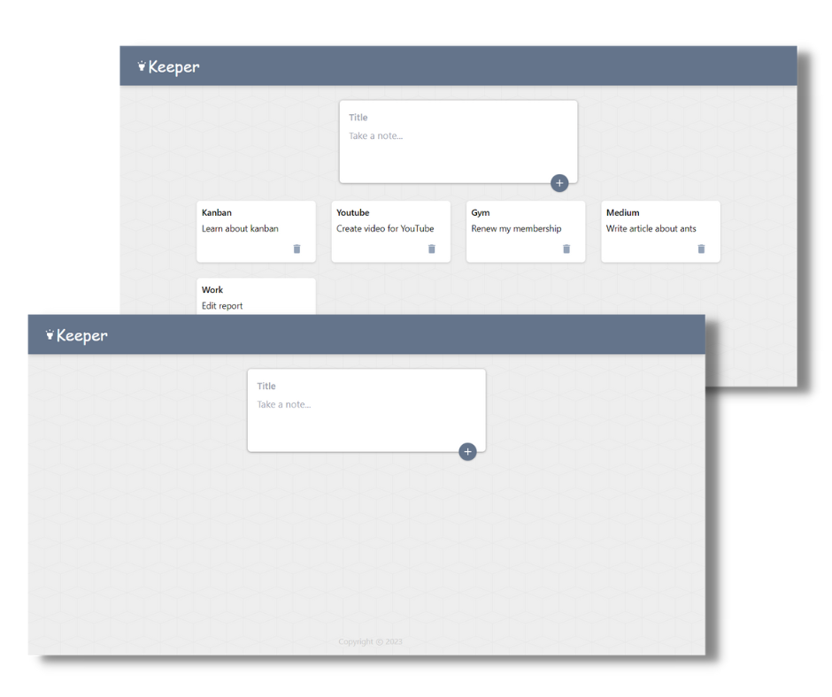

# Keeper App

Keeper App is clone of google keep. This app is a web-based application that provides users with a simple and intuitive platform to capture and organize their thoughts and ideas, and store important information. The app is designed to be user-friendly, and it offers a variety of features that help users to stay organized and productive.

### Links

- Live Site URL: [https://keeper-pperdana.netlify.app](https://keeper-pperdana.netlify.app)

## Table of contents
 
  - [Overview](#overview)
    - [The challenge](#the-challenge)
    - [Screenshot](#screenshot)
 
  - [Tech stack](#tech-stack)
 
  - [Author](#author)
  

## Overview

### The challenge

- View the optimal layout for the interface depending on their device's screen size
- Create and edit notes
- Archive or delete notes to keep workspace clean and organized

### Screenshot

## Tech stack
- React
- Tailwind
- TypeScript
- React Hook
- Semantic HTML5 markup
- CSS custom properties
- Mobile-first workflow
- Flexbox

## Author

- Website - [pperdana.netlify.app](https://pperdana.netlify.app)
- Frontend Mentor - [@Panji200](https://www.frontendmentor.io/profile/Panji200)
