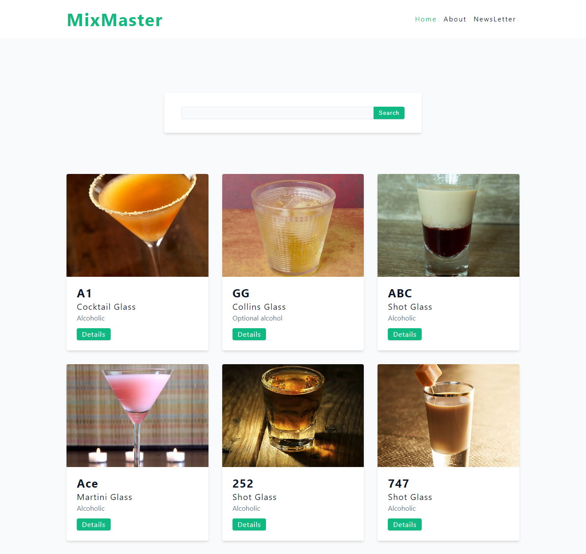

# Mix master
Introducing "MixMaster", the ultimate companion app for gatherings, sourcing delightful cocktails from the Cocktails DB API.With a simple swipe, you'll access a wealth of captivating drink recipes that will tantalize your taste buds and fill your friends with delight. 

### Links

- Live Site URL: [https://mixmaster-pperdana.netlify.app](https://mixmaster-pperdana.netlify.app/)

## Table of contents

- [Links](#links)
- [Table of contents](#table-of-contents)
- [Overview](#overview)
  - [The challenge](#the-challenge)
  - [Screenshot](#screenshot)
- [Tech stack](#tech-stack)
- [Author](#author)

## Overview

### The challenge
User should be able to:
- Search about drink from app.
- Find out more information about specific cocktails.
- Utilizing the popular cocktail DB API.
- Enables seamless navigation and routing in React applications.
- View the optimal layout for the interface depending on their device's screen size

### Screenshot

## Tech stack

- React
- Styled Components
- TypeScript
- Axios
- React Router
- React Toastify
- Mobile-first workflow
- Flexbox

## Author

- Website - [pperdana.netlify.app](https://pperdana.netlify.app)
- Frontend Mentor - [@Panji200](https://www.frontendmentor.io/profile/Panji200)
